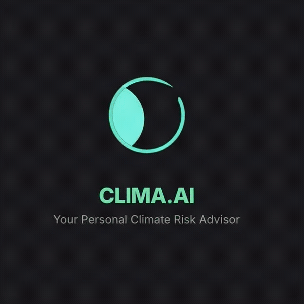

<div align="center">
  
  <h1>CLIMA.AI</h1>
  <p><strong>Your Personal AI Climate Risk Advisor</strong></p>
  
  <p>
    
    
    
    
  </p>
</div>

---

**CLIMA** is a sophisticated, AI-powered web application designed to make climate change personal. It demystifies complex climate data, providing hyper-local risk analysis, data-driven future simulations, and a personalized, interactive action plan to help you prepare for a changing world.

<br/>

<div align="center">
  
</div>

## ✨ Key Features

-   📍 **Hyper-Local Risk Analysis:** Uses your geolocation to fetch real-time weather and historical climate data for your specific area.
-   🧠 **AI-Powered Future Simulations:** Go beyond historical data with an AI-generated, data-driven forecast chart that projects climate trends 5-10 years into the future.
-   📋 **Interactive Action Plans:** Receive a personalized, AI-generated action plan that you can use as an interactive checklist, tracking your progress from "To Do" to "Completed".
-   🌍 **AI-Powered Community Hub:** Anonymously compare your area's preparedness efforts with others, featuring an AI-generated local summary and key community-wide statistics.
-   🏅 **Gamified Daily Challenges:** Get a fresh set of AI-generated, personalized challenges every day to help you reduce your carbon footprint in a fun and engaging way.
-   💬 **Conversational AI Assistant:** Chat directly with a knowledgeable AI assistant that can answer your climate questions, fetch live weather data, and even summarize your reports using function calling.
-   ☀️/🌙 **Light & Dark Themes:** A beautifully crafted, fully-featured dark mode for user comfort, with your preference saved automatically.
-   🔌 **Robust Offline Access:** Previously generated reports are cached on your device, ensuring you can access your critical preparedness plans even without an internet connection.

## 🚀 Feature Spotlights

<table>
  <tr>
    <td align="center">
      <strong>AI-Powered Future Simulation</strong><br/>
      <em>Compare historical data with an AI-generated forecast.</em>
    </td>
    <td align="center">
      <strong>Interactive Action Plan</strong><br/>
      <em>Track your progress on your personalized checklist.</em>
    </td>
  </tr>
  <tr>
    <td>
      
    </td>
    <td>
      
    </td>
  </tr>
  <tr>
    <td align="center" colspan="2">
      <strong>Conversational AI Assistant</strong><br/>
      <em>Ask questions and get real-time answers using AI tools.</em>
    </td>
  </tr>
    <tr>
    <td colspan="2" align="center">
      
    </td>
  </tr>
</table>

## 🛠️ Tech Stack

-   **Frontend:** React 19, TypeScript, Tailwind CSS
-   **AI & Machine Learning:** Google Gemini API (`gemini-2.5-flash`, `gemini-flash-lite-latest`)
-   **Data APIs:** Open-Meteo API for historical climate and live weather data.

## 🏁 Getting Started

To get a local copy up and running, follow these simple steps.

### Prerequisites

-   A Google Gemini API Key. You can get one from [Google AI Studio](https://ai.google.dev/).

### Installation

1.  **Clone the repo:**
    ```sh
    git clone https://github.com/abhijatsarari/clima-ai.git
    cd clima-ai
    ```

2.  **Set up your API Key:**
    This project runs directly in the browser. You need to make your API key available to the application.
    
    *   Create a new file named `dev.js` in the root of the project.
    
    *   Add the following line to `dev.js`, replacing `YOUR_API_KEY` with your actual Google Gemini API key:
        ```javascript
        window.process = { env: { API_KEY: 'YOUR_API_KEY' } };
        ```
    
    *   Load this script in `index.html` **before** the main application script by adding the following line inside the `<body>` tag, right before the `index.tsx` script tag:
        ```html
        <script src="/dev.js"></script>
        ```
    > **Note:** Do not commit your `dev.js` file to Git! Add it to your `.gitignore` file.

3.  **Run the application:**
    Open the `index.html` file in your web browser. A local development server is recommended for the best experience.

## 📂 Project Structure

```
/
├── .github/assets/   # Images and GIFs for the README
│   ├── clima-logo-animation.gif
│   └── ...
├── components/       # Reusable React components for each UI section
│   ├── ActionPlan.tsx
│   ├── FutureProjectionChart.tsx
│   └── ...
├── services/         # Modules for interacting with external APIs
│   ├── geminiService.ts
│   ├── climateDataService.ts
│   └── ...
├── types.ts          # Shared TypeScript type definitions
├── index.html        # The main HTML file and entry point
├── index.tsx         # React application root
├── metadata.json     # Application metadata
└── README.md         # You are here!
```

## 🤝 Contributing

Contributions are what make the open-source community such an amazing place to learn, inspire, and create. Any contributions you make are **greatly appreciated**.

1.  Fork the Project
2.  Create your Feature Branch (`git checkout -b feature/AmazingFeature`)
3.  Commit your Changes (`git commit -m 'Add some AmazingFeature'`)
4.  Push to the Branch (`git push origin feature/AmazingFeature`)
5.  Open a Pull Request

## 📜 License

Distributed under the MIT License.
